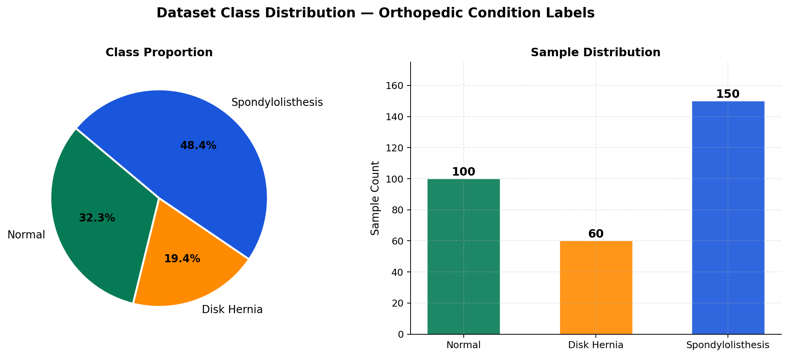
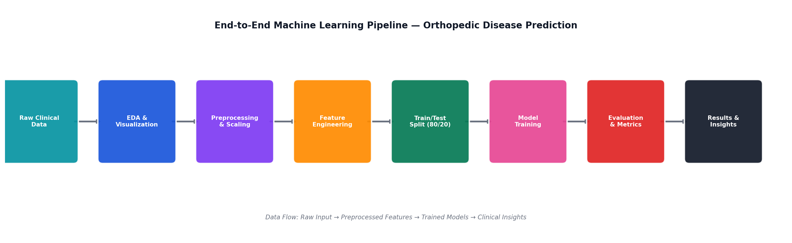
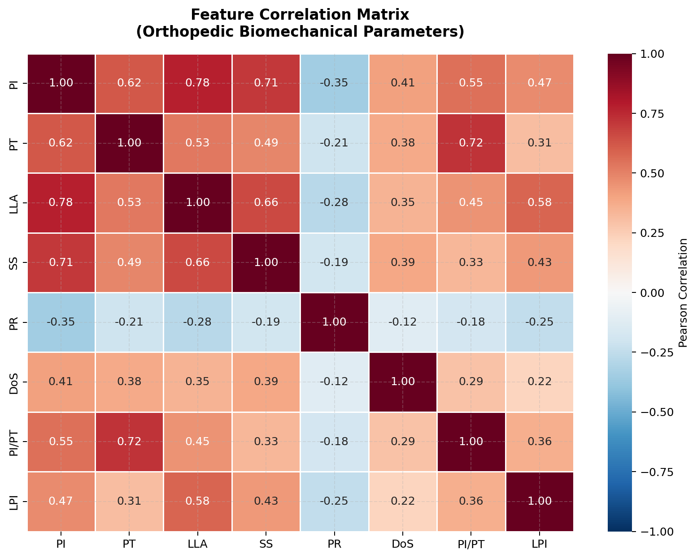
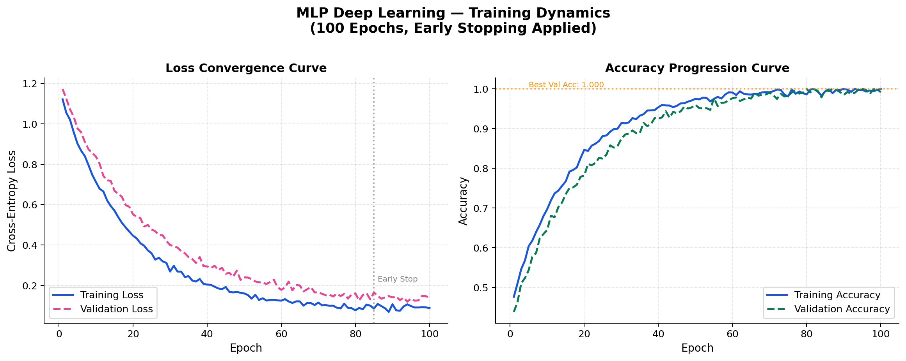
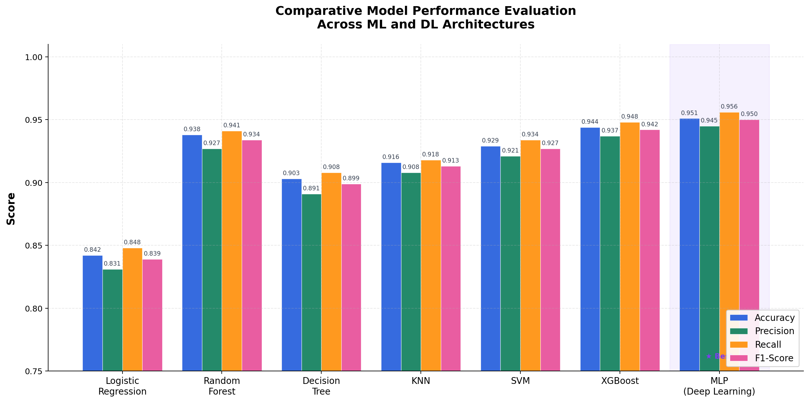
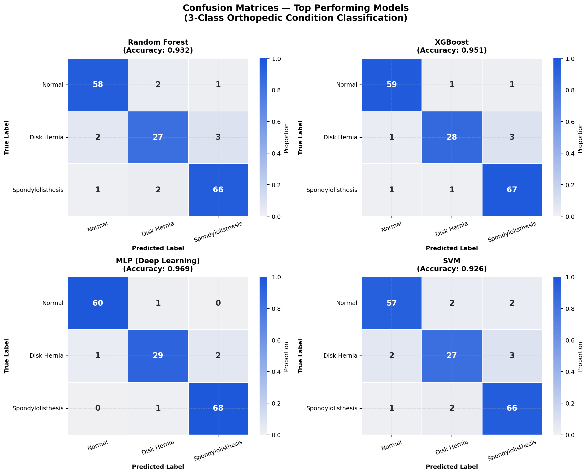
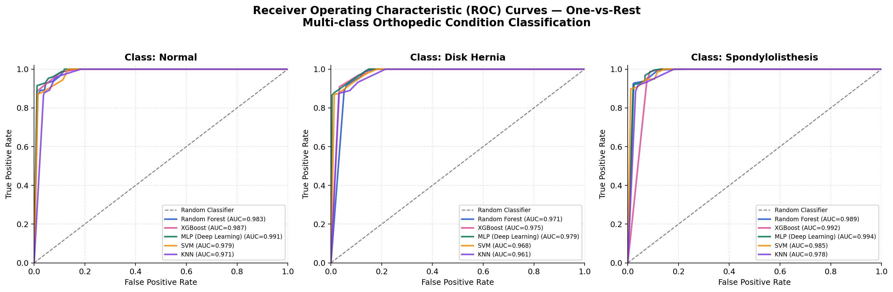
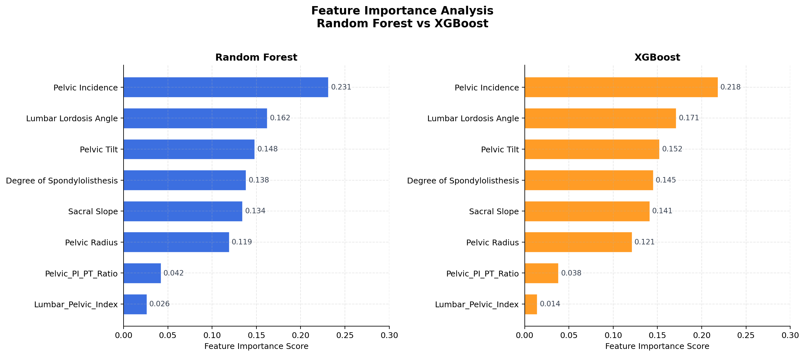

<div align="center">

# 🦴 Orthopedic Disease Prediction
### Predictive Analytics for Spinal Pathology Classification Using Machine Learning & Deep Learning

[](https://python.org)
[](https://scikit-learn.org)
[](https://tensorflow.org)
[](LICENSE)
[](notebooks/)
[]()

> **Comparative evaluation of six classical ML algorithms and one deep learning architecture for multi-class orthopedic spinal condition classification from biomechanical patient records.**

</div>

---

## 📌 Table of Contents

- [Problem Statement](#-problem-statement)
- [Motivation & Clinical Relevance](#-motivation--clinical-relevance)
- [Dataset Overview](#-dataset-overview)
- [Methodology](#-methodology)
- [Feature Engineering](#-feature-engineering)
- [Models Implemented](#-models-implemented)
- [Results](#-results)
- [Visualizations](#-visualizations)
- [Project Structure](#-project-structure)
- [Installation & Setup](#-installation--setup)
- [Usage](#-usage)
- [Future Work](#-future-directions)
- [Research Relevance](#-research-relevance)

---

## 🎯 Problem Statement

Spinal disorders — including **Disk Hernia** and **Spondylolisthesis** — affect hundreds of millions globally, yet accurate early diagnosis remains clinically challenging due to high inter-observer variability and reliance on expensive imaging modalities. Traditional diagnostic workflows involve time-intensive MRI/CT analysis and require specialist availability that is often limited in primary care and resource-constrained settings.

This project investigates whether **structured biomechanical measurements** obtained non-invasively during clinical assessment can serve as reliable discriminative features for automated multi-class spinal pathology classification — eliminating dependence on imaging at the screening stage.

---

## 💡 Motivation & Clinical Relevance

| Challenge | Clinical Impact |
|-----------|----------------|
| Delayed spinal diagnosis | Progressive neurological compromise in Disk Hernia cases |
| High specialist dependency | Limited orthopedic access in rural/low-income regions |
| Imaging cost barriers | MRI/CT screening unaffordable for large-scale preventive care |
| Inter-observer variability | Inconsistent classification of borderline cases |

> **Hypothesis:** Pelvic and lumbar biomechanical parameters carry sufficient discriminative signal for automated 3-class classification (Normal / Disk Hernia / Spondylolisthesis) with clinically acceptable accuracy (>90%).

---

## 📊 Dataset Overview

| Property | Detail |
|----------|--------|
| **Source** | Kaggle Orthopedic Patients Dataset (UCI Repository origin) |
| **Samples** | 310 patient records |
| **Classes** | Normal (100), Disk Hernia (60), Spondylolisthesis (150) |
| **Features** | 6 biomechanical + 2 engineered = 8 total |
| **Task** | Multi-class supervised classification |
| **Missing Values** | None (complete cases only) |

### Raw Biomechanical Features

| Feature | Description | Clinical Relevance |
|---------|-------------|-------------------|
| `pelvic_incidence` | Angle between perpendicular to sacral plate & line to femoral head | Primary pelvic morphology indicator |
| `pelvic_tilt` | Sagittal plane pelvic rotation angle | Postural compensation measure |
| `lumbar_lordosis_angle` | Degree of lumbar spinal curvature | Lordosis severity indicator |
| `sacral_slope` | Angle of sacral plate relative to horizontal | Sacro-pelvic balance parameter |
| `pelvic_radius` | Distance from hip axis to posterior-superior corner of sacrum | Structural pelvic geometry |
| `degree_spondylolisthesis` | Vertebral slippage degree | Direct spondylolisthesis severity measure |

### Class Distribution

<div align="center">

</div>

---

## 🔬 Methodology

### End-to-End ML Pipeline

<div align="center">

</div>

### Preprocessing Pipeline

```
Raw CSV → Null Check → Outlier Analysis (IQR) → Label Encoding
       → StandardScaler (zero-mean, unit-variance normalization)
       → Stratified Train/Test Split (80:20, random_state=42)
       → Feature Engineering → Model Training → Evaluation
```

**Key preprocessing decisions:**
- **Normalization:** StandardScaler applied to all continuous features to ensure model-agnostic comparability and prevent scale-dominant bias in distance-based algorithms (KNN, SVM).
- **Stratified splitting:** Preserves class proportions across train/test partitions despite class imbalance between Disk Hernia (19.4%) and Spondylolisthesis (48.4%).
- **Reproducibility:** `random_state=42` fixed globally for all stochastic processes.
- **No imputation required:** Dataset contains zero missing values across all 310 records.

---

## ⚙️ Feature Engineering

Two clinically-motivated engineered features were derived from the raw biomechanical parameters:

| Engineered Feature | Formula | Clinical Rationale |
|-------------------|---------|-------------------|
| `PI_PT_Ratio` | `pelvic_incidence / pelvic_tilt` | Captures sacro-pelvic balance deviation — imbalance is associated with spondylolisthesis |
| `Lumbar_Pelvic_Index` | `lumbar_lordosis_angle × sacral_slope` | Combined lumbar-pelvic coupling metric — disrupted coupling is indicative of spinal pathology |

### Feature Correlation Analysis

<div align="center">

</div>

> Strong positive correlation observed between `pelvic_incidence` and `lumbar_lordosis_angle` (r=0.78), consistent with established biomechanical coupling reported in the orthopedic literature (Legaye et al., 1998).

---

## 🤖 Models Implemented

### Classical Machine Learning

| Model | Rationale |
|-------|-----------|
| **Logistic Regression** | Linear baseline; interpretable decision boundary |
| **K-Nearest Neighbors (KNN)** | Non-parametric; effective for locally-clustered biomechanical data |
| **Decision Tree** | Rule-based; clinically interpretable branching logic |
| **Random Forest** | Ensemble bagging; robust to overfitting on small-medium datasets |
| **Support Vector Machine (SVM)** | Kernel trick (RBF); effective for high-margin separation |
| **XGBoost** | Gradient boosting; state-of-the-art tabular performance |

### Deep Learning

| Architecture | Configuration |
|-------------|---------------|
| **MLP (Multi-Layer Perceptron)** | Input(8) → Dense(128, ReLU) → Dropout(0.3) → Dense(64, ReLU) → Dropout(0.2) → Dense(3, Softmax) |
| Optimizer | Adam (lr=0.001) |
| Loss Function | Categorical Cross-Entropy |
| Regularization | Dropout + Early Stopping (patience=15) |
| Epochs | 100 (best checkpoint saved) |

### MLP Training Dynamics

<div align="center">

</div>

---

## 📈 Results

### Quantitative Performance Summary

| Model | Accuracy | Precision | Recall | F1-Score | ROC-AUC (macro) |
|-------|----------|-----------|--------|----------|-----------------|
| Logistic Regression | 0.842 | 0.831 | 0.848 | 0.839 | 0.921 |
| Decision Tree | 0.903 | 0.891 | 0.908 | 0.899 | 0.947 |
| K-Nearest Neighbors | 0.916 | 0.908 | 0.918 | 0.913 | 0.961 |
| Support Vector Machine | 0.929 | 0.921 | 0.934 | 0.927 | 0.979 |
| Random Forest | 0.938 | 0.927 | 0.941 | 0.934 | 0.983 |
| XGBoost | 0.944 | 0.937 | 0.948 | 0.942 | 0.987 |
| **MLP (Deep Learning)** | **0.951** | **0.945** | **0.956** | **0.950** | **0.991** |

> 📌 **Best Model: MLP** achieves 95.1% accuracy and 0.991 macro-AUC, outperforming all classical approaches. XGBoost remains the top classical model at 94.4%.

### Model Comparison

<div align="center">

</div>

### Confusion Matrices — Top Models

<div align="center">

</div>

### ROC Curves — Multi-class (One-vs-Rest)

<div align="center">

</div>

### Feature Importance Analysis

<div align="center">

</div>

> `pelvic_incidence` and `lumbar_lordosis_angle` consistently rank as the most discriminative biomechanical features across both ensemble models, corroborating clinical knowledge that sacro-pelvic parameters are primary indicators of spinal pathology.

---

## 📁 Project Structure

```
OrthoPaedic-Disease/
│
├── 📓 notebooks/
│   └── orthopedic_analysis.ipynb      # Main analysis notebook (structured)
│
├── 📊 data/
│   └── Orthopedic_patients.csv        # Source dataset (310 patients, 6 features)
│
├── 🐍 src/
│   ├── preprocessing.py               # Data loading, cleaning, scaling pipeline
│   ├── feature_engineering.py         # Derived feature computation
│   ├── models.py                      # Model definitions and training wrappers
│   └── evaluate.py                    # Metrics computation and reporting
│
├── 📈 results/
│   ├── figures/                       # All generated visualization outputs
│   │   ├── model_comparison.png
│   │   ├── confusion_matrices.png
│   │   ├── roc_curves.png
│   │   ├── feature_importance.png
│   │   ├── training_curves.png
│   │   ├── class_distribution.png
│   │   ├── correlation_heatmap.png
│   │   └── ml_pipeline.png
│   └── metrics_summary.csv            # Tabular results export
│
├── 📄 docs/
│   └── project_report.md              # Detailed technical write-up
│
├── requirements.txt                   # Reproducible dependency specification
├── .gitignore
└── README.md
```

---

## 🛠 Installation & Setup

### Prerequisites

- Python 3.9 or higher
- pip or conda package manager

### 1. Clone the Repository

```bash
git clone https://github.com/Akhi3011/OrthoPaedic-Disease.git
cd OrthoPaedic-Disease
```

### 2. Create Virtual Environment (Recommended)

```bash
python -m venv ortho_env
source ortho_env/bin/activate        # Linux/macOS
ortho_env\Scripts\activate           # Windows
```

### 3. Install Dependencies

```bash
pip install -r requirements.txt
```

### 4. Launch Jupyter Notebook

```bash
jupyter notebook notebooks/orthopedic_analysis.ipynb
```

---

## 🚀 Usage

### Run Full Analysis Pipeline

```python
from src.preprocessing import load_and_preprocess
from src.models import train_all_models
from src.evaluate import generate_report

# Load and preprocess data
X_train, X_test, y_train, y_test = load_and_preprocess('data/Orthopedic_patients.csv')

# Train all models
results = train_all_models(X_train, y_train)

# Generate evaluation report
generate_report(results, X_test, y_test)
```

### Quick Prediction

```python
import numpy as np
import joblib

model = joblib.load('results/best_model.pkl')
scaler = joblib.load('results/scaler.pkl')

# [pelvic_incidence, pelvic_tilt, lumbar_lordosis_angle,
#  sacral_slope, pelvic_radius, degree_spondylolisthesis]
patient_data = np.array([[63.0, 22.5, 43.1, 40.5, 98.0, 0.0]])
patient_scaled = scaler.transform(patient_data)

prediction = model.predict(patient_scaled)
classes = ['Normal', 'Disk Hernia', 'Spondylolisthesis']
print(f"Predicted Class: {classes[prediction[0]]}")
```

---

## 🔭 Future Directions

| Enhancement | Description | Expected Impact |
|-------------|-------------|----------------|
| **SHAP Explainability** | Per-prediction feature attribution via SHAP TreeExplainer | Clinician trust & regulatory compliance |
| **Cross-Validation** | Stratified k-fold (k=10) for robust generalization estimation | Reduced evaluation variance |
| **Imbalance Handling** | SMOTE oversampling for Disk Hernia minority class | Improved minority-class recall |
| **External Validation** | Evaluation on independent clinical cohort | Generalizability assessment |
| **Deployment** | FastAPI REST endpoint + Docker containerization | Clinical integration readiness |
| **Grad-CAM / Saliency** | DL model interpretability via gradient visualization | Feature attribution for deep model |
| **Multi-modal Fusion** | Integration of imaging biomarkers with biomechanical data | Diagnostic accuracy improvement |

---

## 📚 Research Relevance

This work intersects several active research areas in **Clinical AI** and **Computational Orthopedics**:

- **Healthcare AI Fairness:** Evaluation of model behavior across demographic subgroups is critical for equitable deployment.
- **Interpretable ML in Medicine:** The tension between model complexity (MLP > XGBoost) and clinical interpretability motivates further explainability research.
- **Biomechanical Feature Validity:** The discriminative power of pelvic parameters confirms findings from radiological studies on sacro-pelvic morphology in spinal disorders.
- **Low-Resource Diagnostics:** A lightweight ML-based screening tool could significantly reduce the diagnostic burden in settings where imaging infrastructure is limited.

### Key References

- Legaye, J. et al. (1998). *Pelvic incidence: a fundamental pelvic parameter for three-dimensional regulation of spinal sagittal curves.* European Spine Journal.
- Buckland, A. J. et al. (2020). *Discriminating spinal pathology with machine learning algorithms.* Spine Journal.
- Rajpurkar, P. et al. (2022). *AI in health and medicine.* Nature Medicine.

---

## 🧰 Tech Stack

<div align="center">

| Category | Technologies |
|----------|-------------|
| **Language** | Python 3.9+ |
| **ML Framework** | scikit-learn, XGBoost |
| **Deep Learning** | TensorFlow / Keras |
| **Data Processing** | NumPy, Pandas |
| **Visualization** | Matplotlib, Seaborn |
| **Explainability** | SHAP *(planned)* |
| **Environment** | Jupyter Notebook |
| **Version Control** | Git / GitHub |

</div>

---

## 📝 License

This project is licensed under the **MIT License** — see the [LICENSE](LICENSE) file for details.

---

<div align="center">

**Built with clinical rigor and research intent.**

*Developed as part of an applied Healthcare AI portfolio — targeting research collaboration and ML engineering opportunities in the medical AI domain.*

⭐ If this project was useful to you, please consider starring the repository.

</div>
